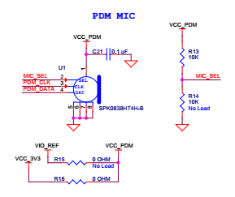

Samples taken from the digital MIC present on the PSoC6 dev kit.

Digital Mic: SPK0838HT4H-B.

PDM_CLOCK @ 1MHz

MIC_SEL is tied to Vcc via R13 so the audio is samples at the rising edge of the PDM_CLOCK signal.
